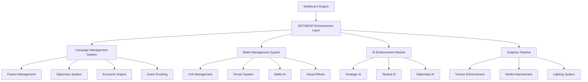

# Medieval III Total War - Master Development Documentation
## SPARC Framework Implementation Guide

**Version:** 1.0  
**Date:** September 2025  
**Project Status:** Foundation Phase  
**Document Type:** Master Reference

---

## Table of Contents

1. [Executive Summary](#executive-summary)
2. [Project Vision and Scope](#project-vision-and-scope)
3. [SPARC Framework Implementation](#sparc-framework-implementation)
4. [Technical Architecture Overview](#technical-architecture-overview)
5. [Development Methodology](#development-methodology)
6. [Quality Assurance Framework](#quality-assurance-framework)
7. [Risk Management Strategy](#risk-management-strategy)
8. [Resource Allocation Plan](#resource-allocation-plan)
9. [Success Metrics and KPIs](#success-metrics-and-kpis)
10. [Timeline and Milestones](#timeline-and-milestones)
11. [Appendices](#appendices)

---

## Executive Summary

### SPARC Overview

The Medieval III Total War mod project represents an ambitious transformation of the Medieval II: Total War engine into a comprehensive medieval warfare experience that bridges historical authenticity with modern game design principles. This master document applies the SPARC framework (Specification, Pseudocode, Architecture, Refinement, Completion) to ensure systematic development, quality assurance, and successful project delivery.

**Foundation Status:** Built upon Gigantus's Kingdoms Geomod Base (v2.2.6), providing a stable, fully functional Grand Campaign with Kingdoms features, Steam compatibility, and comprehensive tooling support.

**Key Differentiators:**
- Advanced AI-driven graphics pipeline integration
- M2TWEOP (Medieval II Total War Engine Overhaul Project) enhanced capabilities
- Community-driven development with continuous feedback integration
- Modern software development practices applied to legacy engine modification

---

## Project Vision and Scope

### Vision Statement

To create the definitive medieval warfare experience that combines the strategic depth of Medieval II: Total War with modern gaming standards, enhanced graphics capabilities, improved AI systems, and comprehensive historical accuracy while maintaining accessibility for both casual and hardcore strategy gaming audiences.

### Core Objectives

**Primary Goals:**
1. **Historical Authenticity:** Accurate representation of medieval period (1080-1530 CE)
2. **Technical Excellence:** Leverage M2TWEOP capabilities for enhanced performance
3. **Visual Enhancement:** Implement AI-driven graphics pipeline for modern visual standards
4. **Gameplay Innovation:** Balanced improvements to core mechanics without compromising strategic depth
5. **Community Integration:** Establish sustainable development and maintenance ecosystem

**Secondary Goals:**
1. **Educational Value:** Historically informative content and scenarios
2. **Modding Support:** Robust tools and documentation for community contributions
3. **Accessibility:** Multiple difficulty levels and interface improvements
4. **Multiplayer Enhancement:** Improved networking and balance for competitive play

### Scope Boundaries

**In Scope:**
- Campaign map enhancements and historical accuracy improvements
- Unit balance, statistics, and visual model upgrades
- AI behavior improvements and diplomacy system enhancement
- Battle system mechanics refinement
- User interface modernization within engine constraints
- Graphics pipeline integration with AI upscaling capabilities
- Sound and music enhancement packages
- Historical event scripting and dynamic campaign elements

**Out of Scope:**
- Complete engine replacement or fundamental architecture changes
- 3D graphics engine overhaul beyond texture and model improvements
- Real-time strategy conversion (maintaining turn-based campaign structure)
- Platform expansion beyond Windows PC (Steam) compatibility
- Multiplayer architecture redesign (working within existing framework)

### Target Audience

**Primary Audience:**
- Total War series veterans seeking enhanced medieval experience
- Strategy gaming enthusiasts with interest in historical periods
- Modding community members and content creators

**Secondary Audience:**
- Educational institutions using games for medieval history instruction
- Competitive strategy gaming community
- Content creators and streamers focusing on strategy games

---

## SPARC Framework Implementation

## S - Specification

### Project Definition

**Core Product Definition:**
Medieval III Total War is a comprehensive modification of Medieval II: Total War that transforms the base game into a historically accurate, technically enhanced, and strategically refined medieval warfare simulation. The project leverages the Kingdoms Geomod Base as its foundation and integrates modern development practices with community-driven enhancement methodologies.

### Success Criteria and Deliverables

**Phase 1 Deliverables (Foundation):**
- Enhanced campaign map with improved geographical accuracy
- Rebalanced faction capabilities and historical accuracy improvements
- Basic AI graphics pipeline integration for texture enhancement
- Comprehensive testing framework implementation
- Community feedback integration system establishment

**Phase 2 Deliverables (Enhancement):**
- Advanced unit model and animation improvements
- Diplomatic system overhaul with historical context integration
- Battle AI enhancement package
- Comprehensive sound and music replacement/enhancement
- Advanced modding tools and documentation package

**Phase 3 Deliverables (Refinement):**
- Full AI graphics pipeline implementation
- Advanced campaign scripting and dynamic events
- Multiplayer balance and networking improvements
- Complete localization support for major languages
- Professional-grade quality assurance and testing completion

**Success Metrics:**
- Community adoption rate (target: 10,000+ active users within 6 months)
- Technical stability (target: <1% crash rate in campaign mode)
- Historical accuracy rating (target: 95%+ accuracy for major events/factions)
- Performance improvement (target: 20%+ fps improvement over base game)
- Community satisfaction (target: 4.5/5.0 average rating across platforms)

### Technical Requirements and Constraints

**Engine Constraints:**
- Medieval II: Total War engine limitations (32-bit architecture, memory constraints)
- M2TWEOP compatibility requirements and feature limitations
- Steam Workshop integration capabilities and restrictions
- Windows platform compatibility (Windows 7-11 support)

**Performance Requirements:**
- Minimum 60 FPS in campaign mode on recommended hardware specifications
- Maximum 4GB RAM usage (32-bit engine constraint)
- Campaign turn processing time <30 seconds for large maps
- Battle loading time <45 seconds for maximum unit count scenarios

**Compatibility Requirements:**
- Steam version compatibility (primary)
- CD/DVD version compatibility (secondary)
- M2TWEOP integration (mandatory)
- Existing save game migration support (where technically feasible)
- Major operating system version support (Windows 7, 8, 10, 11)

### User Requirements Analysis

**Core User Needs:**
1. **Enhanced Visual Experience:** Modern graphics standards within engine constraints
2. **Historical Accuracy:** Authentic medieval period representation
3. **Strategic Depth:** Meaningful tactical and strategic decision-making
4. **Technical Stability:** Reliable, crash-free gaming experience
5. **Community Integration:** Sharing capabilities and community features

**User Interface Requirements:**
- Intuitive navigation maintaining Total War UI conventions
- Accessibility improvements for users with disabilities
- Multi-language support for international community
- Customizable interface elements and hotkey configurations
- Clear information display for complex strategic information

---

## P - Pseudocode/Planning

### High-Level Development Algorithm

```
MEDIEVAL_III_DEVELOPMENT_PROCESS {
    // Phase 1: Foundation and Analysis
    INITIALIZE_PROJECT {
        ANALYZE base_game_assets()
        INVENTORY existing_modifications()
        ESTABLISH development_environment()
        CREATE version_control_system()
        SETUP community_feedback_channels()
    }
    
    // Phase 2: Core System Enhancement
    WHILE (development_phase < COMPLETION) {
        FOR each_major_system IN [campaign, battle, diplomacy, AI, graphics] {
            ANALYZE current_implementation()
            DESIGN improvements()
            IMPLEMENT changes_iteratively()
            TEST comprehensive_scenarios()
            COLLECT community_feedback()
            REFINE based_on_feedback()
        }
        
        INTEGRATE systems()
        PERFORM full_system_testing()
        RELEASE development_build()
        
        IF (stability_criteria_met() && community_approval()) {
            ADVANCE to_next_phase()
        } ELSE {
            ITERATE improvements()
        }
    }
    
    // Phase 3: Optimization and Release
    FINALIZE_PRODUCT {
        OPTIMIZE performance()
        COMPLETE documentation()
        PREPARE release_package()
        ESTABLISH maintenance_procedures()
    }
}
```

### Core System Interaction Flows

**Campaign System Flow:**
```
CAMPAIGN_TURN_PROCESSING {
    UPDATE faction_status()
    PROCESS diplomatic_actions()
    EXECUTE economic_calculations()
    TRIGGER historical_events()
    UPDATE AI_decision_making()
    RENDER campaign_map_changes()
    SAVE turn_state()
}
```

**Battle System Flow:**
```
BATTLE_INITIALIZATION {
    LOAD terrain_and_weather()
    POSITION armies()
    APPLY unit_modifications()
    INITIALIZE AI_behavior_trees()
    BEGIN real_time_combat()
    MONITOR performance_metrics()
}
```

**Graphics Pipeline Flow:**
```
AI_GRAPHICS_ENHANCEMENT {
    IDENTIFY texture_candidates()
    APPLY AI_upscaling_algorithms()
    VALIDATE visual_quality()
    OPTIMIZE for_performance()
    INTEGRATE enhanced_textures()
    TEST visual_consistency()
}
```

### Decision Trees for Implementation

**Feature Implementation Decision Tree:**
```
FEATURE_IMPLEMENTATION_DECISION {
    IF (feature_improves_historical_accuracy) {
        IF (technically_feasible_within_constraints) {
            IF (performance_impact_acceptable) {
                IMPLEMENT with_high_priority()
            } ELSE {
                OPTIMIZE or_DEFER()
            }
        } ELSE {
            DOCUMENT as_future_enhancement()
        }
    }
    
    IF (feature_enhances_gameplay) {
        EVALUATE community_demand()
        ASSESS development_resources()
        PRIORITIZE based_on_impact_vs_effort()
    }
    
    IF (feature_improves_technical_foundation) {
        IMPLEMENT with_highest_priority()
    }
}
```

### Development Phase Workflows

**Weekly Development Cycle:**
1. **Monday:** Community feedback analysis and priority adjustment
2. **Tuesday-Wednesday:** Core development and implementation
3. **Thursday:** Internal testing and quality assurance
4. **Friday:** Documentation update and community preview preparation
5. **Weekend:** Community testing and feedback collection

**Monthly Release Cycle:**
1. **Week 1:** Feature development and implementation
2. **Week 2:** Integration testing and stability verification
3. **Week 3:** Community beta testing and feedback integration
4. **Week 4:** Final testing, documentation, and release preparation

---

## A - Architecture

### Overall System Architecture Design

**Layer Architecture Model:**

```
┌─────────────────────────────────────────────────────────┐
│                    USER INTERFACE LAYER                │
│  Campaign Interface │ Battle Interface │ Mod Manager   │
├─────────────────────────────────────────────────────────┤
│                   GAME LOGIC LAYER                      │
│  Campaign Engine │ Battle Engine │ AI Systems │ Events │
├─────────────────────────────────────────────────────────┤
│                 ENHANCEMENT LAYER                       │
│  M2TWEOP Integration │ Graphics Pipeline │ AI Enhancement│
├─────────────────────────────────────────────────────────┤
│                   DATA ACCESS LAYER                     │
│  Configuration │ Assets │ Save Data │ Community Content │
├─────────────────────────────────────────────────────────┤
│                  MEDIEVAL II ENGINE                     │
│        Base Game Engine (Legacy Components)            │
└─────────────────────────────────────────────────────────┘
```

### Component Relationships and Dependencies

**Core Component Dependencies:**



### Data Flow Diagrams

**Campaign Turn Data Flow:**
```
[User Input] → [Campaign Interface] → [Game Logic Validation] → 
[M2TWEOP Processing] → [AI Decision Making] → [Database Updates] → 
[Visual Updates] → [Save State Management] → [User Feedback]
```

**Battle Initialization Data Flow:**
```
[Campaign Context] → [Battle Parameters] → [Terrain Generation] → 
[Unit Positioning] → [AI Behavior Setup] → [Graphics Pipeline] → 
[Real-time Battle Engine] → [Result Processing] → [Campaign Integration]
```

**Graphics Enhancement Pipeline:**
```
[Source Assets] → [Quality Assessment] → [AI Upscaling] → 
[Manual Refinement] → [Performance Optimization] → [Integration Testing] → 
[Quality Validation] → [Asset Deployment]
```

### Integration Points with Medieval II Engine

**Critical Integration Points:**

1. **File System Integration:**
   - Configuration file override system
   - Asset replacement and addition mechanisms
   - Save game compatibility maintenance
   - Mod loading and priority management

2. **Memory Management:**
   - 32-bit architecture constraint handling
   - Memory pool optimization
   - Asset streaming improvements
   - Garbage collection enhancement

3. **Graphics System Integration:**
   - Texture replacement pipeline
   - Model enhancement system
   - Shader modification capabilities
   - Performance monitoring integration

4. **AI System Enhancement:**
   - Decision tree modification
   - Strategic planning improvement
   - Diplomatic behavior enhancement
   - Performance optimization

**M2TWEOP Specific Integration:**

```
M2TWEOP_INTEGRATION {
    CAMPAIGN_ENHANCEMENTS {
        - Extended faction capabilities
        - Advanced scripting support
        - Enhanced event system
        - Improved save/load functionality
    }
    
    BATTLE_ENHANCEMENTS {
        - Extended unit capabilities
        - Advanced formation controls
        - Enhanced visual effects
        - Improved AI behavior trees
    }
    
    TECHNICAL_ENHANCEMENTS {
        - Memory management improvements
        - Performance optimization
        - Stability enhancements
        - Debugging capabilities
    }
}
```

---

## R - Refinement

### Iterative Improvement Strategies

**Continuous Integration Approach:**

1. **Daily Integration Cycles:**
   - Automated build system with comprehensive testing
   - Performance benchmarking and regression detection
   - Community feedback integration pipeline
   - Version control with feature branching strategy

2. **Weekly Quality Reviews:**
   - Code quality assessment and improvement
   - Performance analysis and optimization
   - Community feedback analysis and prioritization
   - Documentation updates and maintenance

3. **Monthly Release Iterations:**
   - Major feature integration and testing
   - Comprehensive quality assurance cycles
   - Community beta testing coordination
   - Release candidate preparation and validation

**Feedback-Driven Development:**

```
REFINEMENT_PROCESS {
    COLLECT_FEEDBACK {
        community_forums()
        beta_testing_reports()
        automated_crash_reporting()
        performance_telemetry()
        social_media_monitoring()
    }
    
    ANALYZE_FEEDBACK {
        categorize_by_priority()
        assess_technical_feasibility()
        estimate_development_effort()
        evaluate_community_impact()
    }
    
    IMPLEMENT_IMPROVEMENTS {
        prototype_solutions()
        test_with_community()
        iterate_based_on_results()
        integrate_final_solutions()
    }
    
    VALIDATE_IMPROVEMENTS {
        automated_testing()
        community_validation()
        performance_verification()
        stability_confirmation()
    }
}
```

### Quality Assurance Processes

**Multi-Tier Testing Strategy:**

**Tier 1 - Automated Testing:**
- Unit tests for core game logic modifications
- Integration tests for M2TWEOP compatibility
- Performance regression testing
- Save game compatibility validation
- Configuration file validation testing

**Tier 2 - Manual Testing:**
- Campaign scenario testing (full faction campaigns)
- Battle scenario testing (various army compositions)
- Diplomatic interaction testing
- User interface functionality verification
- Graphics enhancement quality validation

**Tier 3 - Community Testing:**
- Beta release community testing programs
- Scenario-specific community validation
- Multiplayer compatibility and balance testing
- Accessibility testing with diverse user groups
- Platform compatibility verification

**Quality Gates:**
```
QUALITY_GATE_CRITERIA {
    STABILITY_REQUIREMENTS {
        crash_rate < 1% in_campaign_mode
        memory_leak_rate < 5MB_per_hour
        save_game_corruption_rate < 0.1%
        loading_time_regression < 10%
    }
    
    PERFORMANCE_REQUIREMENTS {
        fps_improvement >= 15% over_base_game
        memory_usage < 3.5GB peak_usage
        turn_processing_time < 30_seconds
        battle_loading_time < 45_seconds
    }
    
    FUNCTIONALITY_REQUIREMENTS {
        all_critical_features 100% functional
        regression_test_suite 100% passing
        community_satisfaction >= 4.0/5.0
        historical_accuracy >= 95% for_major_elements
    }
}
```

### Testing and Validation Approaches

**Comprehensive Testing Framework:**

**Historical Accuracy Testing:**
- Expert historian consultation and validation
- Primary source documentation cross-reference
- Community historical accuracy feedback integration
- Academic institution partnership for validation

**Technical Performance Testing:**
- Automated performance benchmarking across hardware configurations
- Memory usage profiling and optimization
- Graphics performance testing with various GPU configurations
- Network performance testing for multiplayer scenarios

**User Experience Testing:**
- Usability testing with diverse user groups
- Accessibility testing for users with disabilities
- Interface responsiveness and intuitiveness evaluation
- Learning curve assessment for new players

**Compatibility Testing:**
- Multiple operating system version testing
- Various hardware configuration compatibility
- Steam platform integration testing
- Save game forward and backward compatibility

### Community Feedback Integration Methods

**Feedback Collection Channels:**
1. **Official Forums:** Structured feedback categories and discussion threads
2. **Beta Testing Programs:** Exclusive access for dedicated community testers
3. **Social Media Monitoring:** Twitter, Reddit, YouTube community engagement
4. **In-Game Feedback System:** Integrated reporting and suggestion system
5. **Community Events:** Regular developer-community interaction sessions

**Feedback Processing Workflow:**
```
FEEDBACK_INTEGRATION_WORKFLOW {
    COLLECTION_PHASE {
        monitor_all_channels()
        categorize_feedback_type()
        assess_feedback_validity()
        prioritize_by_impact_and_effort()
    }
    
    ANALYSIS_PHASE {
        technical_feasibility_assessment()
        resource_requirement_estimation()
        community_consensus_evaluation()
        alignment_with_project_vision()
    }
    
    IMPLEMENTATION_PHASE {
        prototype_development()
        community_preview_and_validation()
        iterative_improvement()
        final_implementation()
    }
    
    COMMUNICATION_PHASE {
        progress_update_publication()
        implementation_decision_explanation()
        timeline_communication()
        appreciation_and_recognition()
    }
}
```

---

## C - Completion

### Definition of "Done" for Each Phase

**Phase 1 - Foundation (Complete when):**
- [ ] Stable base installation with zero critical bugs
- [ ] All core systems (campaign, battle, diplomacy) fully functional
- [ ] Community feedback collection system operational
- [ ] Basic AI graphics pipeline integration completed
- [ ] Comprehensive testing framework established
- [ ] Performance benchmarks established and documented
- [ ] Community adoption rate reaches 1,000+ active users

**Phase 2 - Enhancement (Complete when):**
- [ ] All major system enhancements implemented and tested
- [ ] Advanced AI graphics pipeline fully integrated
- [ ] Historical accuracy validation completed by expert consultation
- [ ] Community satisfaction rating reaches 4.0/5.0 or higher
- [ ] Performance improvements of 15%+ demonstrated
- [ ] Multiplayer balance testing completed with community validation
- [ ] Comprehensive documentation package published

**Phase 3 - Refinement (Complete when):**
- [ ] All community-requested features (feasible within scope) implemented
- [ ] Professional-grade quality assurance completed
- [ ] Full localization support for major languages completed
- [ ] Long-term maintenance procedures established
- [ ] Community modding tools and documentation finalized
- [ ] Project sustainability plan implemented
- [ ] Final release version published with full feature completeness

### Release Criteria and Milestones

**Milestone 1 - Alpha Release (Foundation Phase):**
- Core functionality operational
- Basic stability achieved (<5% crash rate)
- Community testing program launched
- Essential documentation completed

**Milestone 2 - Beta Release (Enhancement Phase):**
- Major features implemented and functional
- Stability improved to <2% crash rate
- Community feedback integration demonstrated
- Performance improvements measurable

**Milestone 3 - Release Candidate (Refinement Phase):**
- All planned features completed
- Professional-grade stability achieved (<1% crash rate)
- Community satisfaction targets met
- Comprehensive testing completed

**Milestone 4 - Final Release (Completion Phase):**
- Production-ready quality achieved
- Long-term support procedures established
- Community ecosystem sustainable
- Project objectives fully realized

**Release Quality Gates:**

```
RELEASE_READINESS_CRITERIA {
    FUNCTIONAL_COMPLETENESS {
        all_core_features = IMPLEMENTED
        all_enhancement_features = IMPLEMENTED
        regression_test_suite = 100% PASSING
        community_requested_features = 90% IMPLEMENTED
    }
    
    QUALITY_STANDARDS {
        crash_rate < 1%
        performance_improvement >= 15%
        community_satisfaction >= 4.0/5.0
        historical_accuracy >= 95%
        save_game_compatibility = 100%
    }
    
    OPERATIONAL_READINESS {
        documentation = COMPLETE
        support_procedures = ESTABLISHED
        community_feedback_system = OPERATIONAL
        maintenance_plan = IMPLEMENTED
    }
}
```

### Success Metrics and Evaluation Methods

**Quantitative Success Metrics:**

1. **Technical Performance Metrics:**
   - Frame rate improvement: Target >15% over base game
   - Memory efficiency: Target <3.5GB peak usage
   - Stability index: Target <1% crash rate
   - Loading time optimization: Target <45 seconds for large battles

2. **Community Engagement Metrics:**
   - Active user base: Target 10,000+ monthly active users
   - Community satisfaction: Target 4.5/5.0 average rating
   - Content creation: Target 100+ community-created content pieces
   - Forum engagement: Target 500+ active community contributors

3. **Quality Assurance Metrics:**
   - Bug resolution rate: Target 95% of reported bugs resolved
   - Testing coverage: Target 90% automated test coverage
   - Historical accuracy: Target 95% accuracy for major elements
   - Feature completeness: Target 100% of planned features delivered

**Qualitative Success Metrics:**

1. **Community Recognition:**
   - Industry media coverage and reviews
   - Community awards and recognition
   - Positive word-of-mouth and social media sentiment
   - Integration into gaming content creator ecosystems

2. **Academic and Educational Impact:**
   - Adoption by educational institutions
   - Historical accuracy recognition by academic experts
   - Integration into medieval history educational programs
   - Research publication citations and references

3. **Long-term Sustainability:**
   - Active modding community development
   - Continuous community-driven content creation
   - Long-term technical support viability
   - Influence on future Total War modding projects

### Maintenance and Post-Release Strategies

**Long-term Support Framework:**

**Immediate Post-Release (0-6 months):**
- Critical bug hotfix deployment within 48 hours
- Weekly community feedback review and response
- Monthly stability and performance updates
- Quarterly feature enhancement releases based on community priorities

**Medium-term Support (6-24 months):**
- Bi-monthly update releases with community-driven enhancements
- Annual major content updates with new features
- Continuous community modding tool improvement
- Platform compatibility maintenance and updates

**Long-term Sustainability (24+ months):**
- Community-driven maintenance transition planning
- Open-source component release for community development
- Knowledge transfer and documentation for community maintainers
- Legacy support for critical functionality preservation

**Community Ecosystem Development:**

```
COMMUNITY_ECOSYSTEM_STRATEGY {
    CONTENT_CREATOR_SUPPORT {
        provide_advanced_modding_tools()
        create_comprehensive_documentation()
        establish_community_showcase_programs()
        implement_content_sharing_platforms()
    }
    
    EDUCATIONAL_OUTREACH {
        partner_with_educational_institutions()
        develop_historical_accuracy_resources()
        create_educational_scenario_packages()
        support_academic_research_initiatives()
    }
    
    COMPETITIVE_GAMING {
        establish_tournament_support_systems()
        develop_competitive_balance_frameworks()
        create_esports_integration_capabilities()
        support_streaming_and_content_creation()
    }
}
```

---

## Technical Architecture Overview

### Engine Enhancement Strategy

**M2TWEOP Integration Architecture:**

The Medieval III project leverages the Medieval II Total War Engine Overhaul Project (M2TWEOP) as its primary technical foundation, providing enhanced capabilities beyond the base Medieval II engine limitations. This integration strategy focuses on maximizing engine potential while maintaining stability and compatibility.

**Core Enhancement Areas:**

1. **Memory Management Optimization:**
   - Dynamic memory allocation improvements
   - Asset streaming optimization
   - Memory pool management for large-scale battles
   - Garbage collection enhancement for extended campaign play

2. **Graphics Pipeline Enhancement:**
   - AI-driven texture upscaling integration
   - Advanced lighting system implementation
   - Model enhancement and optimization
   - Shader modification and improvement

3. **AI System Overhaul:**
   - Strategic AI decision-making enhancement
   - Tactical battle AI improvement
   - Diplomatic AI behavior sophistication
   - Performance optimization for complex calculations

4. **Campaign System Enhancement:**
   - Extended scripting capabilities
   - Advanced event system implementation
   - Enhanced faction interaction systems
   - Improved economic modeling

### File Structure and Organization

**Project Directory Architecture:**
```
Medieval_III_Total_War/
├── core_engine/
│   ├── m2tweop_integration/
│   ├── base_game_compatibility/
│   └── enhancement_modules/
├── assets/
│   ├── graphics/
│   │   ├── textures_enhanced/
│   │   ├── models_improved/
│   │   └── ai_upscaled/
│   ├── audio/
│   ├── data/
│   └── configurations/
├── scripts/
│   ├── campaign_events/
│   ├── diplomatic_ai/
│   └── battle_enhancements/
├── tools/
│   ├── development_utilities/
│   ├── community_tools/
│   └── testing_frameworks/
└── documentation/
    ├── technical_specifications/
    ├── user_guides/
    └── community_resources/
```

### Data Management Strategy

**Configuration Management:**
- Hierarchical configuration system with user, mod, and system-level overrides
- Dynamic configuration loading for runtime adjustments
- Version-controlled configuration templates for community distributions
- Automated configuration validation and error reporting

**Asset Management:**
- Intelligent asset streaming for improved loading performance
- AI-enhanced graphics asset processing pipeline
- Community content integration and validation systems
- Version control for community-contributed assets

---

## Development Methodology

### Agile Development Approach

**Sprint Structure:**
- **2-week sprint cycles** optimized for mod development constraints
- **Sprint planning** with community feedback integration
- **Daily standups** for core development team coordination
- **Sprint reviews** with community preview releases
- **Retrospectives** for continuous process improvement

**Development Team Structure:**

**Core Development Team (4-6 members):**
- Technical Lead (M2TWEOP expertise)
- Graphics Enhancement Specialist (AI pipeline)
- Historical Research Coordinator
- Community Relations Manager
- Quality Assurance Lead
- Documentation Specialist

**Community Contributors (Variable):**
- Beta testers (50-100 active participants)
- Content creators (modelers, texture artists, scripters)
- Historical consultants (volunteer experts)
- Translation coordinators (multiple languages)

### Version Control and Release Management

**Git-based Version Control Strategy:**
```
REPOSITORY_STRUCTURE {
    main_branch {
        // Production-ready releases only
        protection_rules = ENABLED
        direct_commits = DISABLED
        pull_request_required = TRUE
    }
    
    development_branch {
        // Active development integration
        continuous_integration = ENABLED
        automated_testing = REQUIRED
        community_preview_builds = AUTOMATED
    }
    
    feature_branches {
        // Individual feature development
        naming_convention = "feature/descriptive-name"
        pull_request_workflow = REQUIRED
        code_review_mandatory = TRUE
    }
    
    hotfix_branches {
        // Critical bug fixes
        priority_merge_path = TRUE
        expedited_testing = ENABLED
        immediate_release_capability = TRUE
    }
}
```

**Release Management Process:**
1. **Feature Development:** Individual feature branches with comprehensive testing
2. **Integration Testing:** Development branch continuous integration
3. **Community Preview:** Beta releases for community testing and feedback
4. **Release Candidate:** Comprehensive testing and quality assurance
5. **Production Release:** Final release with comprehensive documentation

### Community-Driven Development

**Community Contribution Framework:**

**Contribution Categories:**
1. **Code Contributions:** Scripts, AI improvements, optimization
2. **Asset Contributions:** Textures, models, audio, animations
3. **Content Contributions:** Historical research, scenario design, documentation
4. **Testing Contributions:** Bug reporting, compatibility testing, feedback provision

**Contribution Process:**
```
COMMUNITY_CONTRIBUTION_WORKFLOW {
    PROPOSAL_PHASE {
        submit_contribution_proposal()
        community_discussion_and_feedback()
        technical_feasibility_assessment()
        project_alignment_evaluation()
    }
    
    DEVELOPMENT_PHASE {
        create_feature_branch()
        develop_contribution_with_community_support()
        follow_coding_and_asset_standards()
        document_changes_comprehensively()
    }
    
    REVIEW_PHASE {
        submit_pull_request_with_documentation()
        code_review_by_core_team()
        community_testing_and_validation()
        historical_accuracy_verification()
    }
    
    INTEGRATION_PHASE {
        merge_approved_contributions()
        integration_testing_with_existing_systems()
        community_preview_release()
        final_validation_and_release()
    }
}
```

---

## Quality Assurance Framework

### Comprehensive Testing Strategy

**Multi-Level Testing Approach:**

**Level 1 - Unit Testing:**
- Individual script and module functionality verification
- Configuration file validation and error handling
- Asset loading and integration testing
- Performance benchmark validation

**Level 2 - Integration Testing:**
- M2TWEOP compatibility and stability verification
- Cross-system interaction validation (campaign/battle/diplomacy)
- Save game compatibility across versions
- Multiplayer functionality and synchronization

**Level 3 - System Testing:**
- Full campaign completion testing (multiple factions)
- Extended gameplay session stability verification
- Performance testing under maximum load conditions
- Cross-platform compatibility validation

**Level 4 - Acceptance Testing:**
- Community beta testing programs
- Historical accuracy validation by experts
- User experience testing with diverse user groups
- Accessibility testing for inclusive design

### Automated Testing Infrastructure

**Continuous Integration Pipeline:**
```
CI_PIPELINE {
    COMMIT_TRIGGER {
        automated_build_verification()
        unit_test_execution()
        code_quality_analysis()
        security_vulnerability_scanning()
    }
    
    INTEGRATION_TESTING {
        m2tweop_compatibility_verification()
        performance_regression_testing()
        save_game_compatibility_validation()
        asset_integrity_verification()
    }
    
    DEPLOYMENT_PREPARATION {
        release_package_generation()
        documentation_update_verification()
        community_preview_build_preparation()
        release_notes_generation()
    }
}
```

**Performance Monitoring and Optimization:**
- Real-time performance telemetry collection
- Memory usage profiling and optimization
- Loading time monitoring and improvement
- Frame rate stability verification across hardware configurations

### Community Quality Assurance

**Beta Testing Program:**
- **Closed Beta:** 50 experienced community members for initial stability testing
- **Open Beta:** 500+ community members for comprehensive scenario testing
- **Expert Beta:** Historical consultants and mod development experts
- **Accessibility Beta:** Users with diverse accessibility needs

**Quality Feedback Integration:**
```
QUALITY_FEEDBACK_SYSTEM {
    COLLECTION_MECHANISMS {
        in_game_feedback_reporting()
        automated_crash_reporting()
        community_forum_structured_feedback()
        social_media_sentiment_monitoring()
    }
    
    ANALYSIS_AND_PRIORITIZATION {
        categorize_feedback_by_severity_and_type()
        assess_technical_feasibility_of_solutions()
        prioritize_based_on_community_impact()
        estimate_resolution_effort_and_timeline()
    }
    
    RESOLUTION_AND_COMMUNICATION {
        implement_solutions_with_testing()
        communicate_progress_to_community()
        validate_resolution_with_original_reporters()
        document_solutions_for_future_reference()
    }
}
```

---

## Risk Management Strategy

### Technical Risk Assessment

**High-Priority Technical Risks:**

1. **Engine Compatibility Risk:**
   - **Description:** M2TWEOP updates may break existing functionality
   - **Probability:** Medium (30%)
   - **Impact:** High (Project delay of 2-4 weeks)
   - **Mitigation:** Maintain compatibility testing suite, establish M2TWEOP developer communication

2. **Performance Degradation Risk:**
   - **Description:** Enhanced features may significantly impact game performance
   - **Probability:** High (60%)
   - **Impact:** Medium (Community satisfaction reduction)
   - **Mitigation:** Continuous performance monitoring, optimization sprint allocation

3. **Save Game Corruption Risk:**
   - **Description:** Modifications may cause save game incompatibility or corruption
   - **Probability:** Medium (40%)
   - **Impact:** High (Community trust loss)
   - **Mitigation:** Comprehensive save game testing, backward compatibility maintenance

4. **AI Graphics Pipeline Integration Risk:**
   - **Description:** AI enhancement may not integrate smoothly with game engine
   - **Probability:** Medium (35%)
   - **Impact:** Medium (Feature delay or removal)
   - **Mitigation:** Prototype development, gradual integration approach

**Medium-Priority Technical Risks:**

1. **Memory Limitation Risk:** 32-bit engine constraints may limit enhancement scope
2. **Community Tool Compatibility:** Third-party modding tools may become incompatible
3. **Platform Evolution Risk:** Windows updates may affect compatibility
4. **Asset Quality Risk:** AI-enhanced assets may not meet quality expectations

### Community and Project Management Risks

**High-Priority Project Risks:**

1. **Community Fragmentation Risk:**
   - **Description:** Community may split over controversial design decisions
   - **Probability:** Medium (25%)
   - **Impact:** High (Reduced community engagement and contribution)
   - **Mitigation:** Transparent communication, democratic decision-making processes

2. **Key Developer Departure Risk:**
   - **Description:** Core team members may become unavailable
   - **Probability:** Medium (40%)
   - **Impact:** High (Development velocity reduction)
   - **Mitigation:** Knowledge documentation, cross-training, community developer recruitment

3. **Scope Creep Risk:**
   - **Description:** Community requests may expand project beyond manageable scope
   - **Probability:** High (70%)
   - **Impact:** Medium (Timeline extension, resource strain)
   - **Mitigation:** Clear scope definition, change management process, community education

4. **Historical Accuracy Controversy Risk:**
   - **Description:** Historical interpretations may generate community conflict
   - **Probability:** Medium (30%)
   - **Impact:** Medium (Community relations strain)
   - **Mitigation:** Expert consultation, transparent research methodology, community involvement

### Risk Mitigation Strategies

**Proactive Risk Management:**

```
RISK_MANAGEMENT_FRAMEWORK {
    IDENTIFICATION_PROCESS {
        weekly_risk_assessment_reviews()
        community_feedback_risk_analysis()
        technical_debt_evaluation()
        external_dependency_monitoring()
    }
    
    ASSESSMENT_METHODOLOGY {
        probability_impact_matrix_analysis()
        risk_severity_scoring()
        mitigation_cost_benefit_analysis()
        timeline_impact_evaluation()
    }
    
    MITIGATION_IMPLEMENTATION {
        preventive_measure_deployment()
        contingency_plan_development()
        regular_mitigation_effectiveness_review()
        adaptive_strategy_adjustment()
    }
    
    MONITORING_AND_COMMUNICATION {
        risk_status_dashboard_maintenance()
        stakeholder_risk_communication()
        mitigation_progress_tracking()
        lessons_learned_documentation()
    }
}
```

**Contingency Planning:**

1. **Technical Failure Contingencies:**
   - Alternative implementation approaches for critical features
   - Rollback procedures for problematic updates
   - Emergency stability patches and hotfix deployment
   - Community communication protocols for technical issues

2. **Community Relations Contingencies:**
   - Conflict resolution procedures for controversial decisions
   - Alternative communication channels for sensitive discussions
   - Community leadership engagement protocols
   - Reputation management and recovery strategies

---

## Resource Allocation Plan

### Development Team Resource Distribution

**Core Development Team Allocation:**

```
RESOURCE_ALLOCATION_BREAKDOWN {
    TECHNICAL_DEVELOPMENT (60%) {
        Engine_Integration_Specialist (20%)
        Graphics_Enhancement_Developer (15%)
        AI_Systems_Developer (15%)
        Quality_Assurance_Engineer (10%)
    }
    
    CONTENT_AND_RESEARCH (25%) {
        Historical_Research_Coordinator (10%)
        Content_Creation_Specialist (10%)
        Community_Asset_Coordinator (5%)
    }
    
    PROJECT_MANAGEMENT (15%) {
        Community_Relations_Manager (8%)
        Documentation_Specialist (4%)
        Release_Management_Coordinator (3%)
    }
}
```

**Development Phase Resource Allocation:**

**Phase 1 - Foundation (40% of total resources):**
- Engine integration and stability: 60%
- Basic feature implementation: 25%
- Community infrastructure: 15%

**Phase 2 - Enhancement (35% of total resources):**
- Advanced feature development: 50%
- Graphics pipeline integration: 30%
- Community content integration: 20%

**Phase 3 - Refinement (25% of total resources):**
- Quality assurance and testing: 40%
- Community feedback integration: 30%
- Documentation and release preparation: 30%

### Budget and Timeline Considerations

**Development Timeline Overview:**

```
PROJECT_TIMELINE {
    PHASE_1_FOUNDATION {
        Duration: 4_months
        Milestones: [
            "Base Installation Package" (Month 1),
            "Core System Stability" (Month 2),
            "Community Testing Launch" (Month 3),
            "Foundation Complete" (Month 4)
        ]
    }
    
    PHASE_2_ENHANCEMENT {
        Duration: 6_months
        Milestones: [
            "Graphics Pipeline Integration" (Month 2),
            "AI System Enhancement" (Month 4),
            "Community Feature Integration" (Month 5),
            "Enhancement Complete" (Month 6)
        ]
    }
    
    PHASE_3_REFINEMENT {
        Duration: 4_months
        Milestones: [
            "Quality Assurance Complete" (Month 2),
            "Community Validation" (Month 3),
            "Final Release" (Month 4)
        ]
    }
}
```

**Resource Requirements:**

**Human Resources:**
- Core development team: 6 dedicated developers (part-time equivalent)
- Community contributors: 50-100 active volunteers
- Historical consultants: 5-10 expert advisors
- Quality assurance testers: 100+ community beta testers

**Technical Resources:**
- Development hardware and software licensing
- Testing environment setup and maintenance
- Community infrastructure (forums, file hosting, communication tools)
- AI graphics processing resources (GPU time for texture enhancement)

### Community Contribution Integration

**Volunteer Community Resource Optimization:**

```
COMMUNITY_RESOURCE_FRAMEWORK {
    SKILL_BASED_CONTRIBUTION {
        Technical_Contributors {
            - Scripting and programming expertise
            - Asset creation (textures, models, audio)
            - Testing and quality assurance
            - Documentation and tutorial creation
        }
        
        Content_Contributors {
            - Historical research and fact-checking
            - Scenario and campaign design
            - Translation and localization
            - Community moderation and support
        }
        
        Promotion_Contributors {
            - Content creation (videos, streams, articles)
            - Social media engagement and outreach
            - Community event organization
            - New user onboarding and support
        }
    }
    
    CONTRIBUTION_MANAGEMENT {
        Recognition_Systems {
            - Contributor credits in game and documentation
            - Community status and privileges
            - Exclusive access to development previews
            - Annual community contributor awards
        }
        
        Support_Systems {
            - Comprehensive contributor documentation
            - Mentorship programs for new contributors
            - Regular community contributor meetings
            - Technical support for contribution tools
        }
    }
}
```

**Community Engagement Investment:**

- **Community Events:** Monthly developer-community interaction sessions
- **Educational Content:** Tutorial creation and modding guides
- **Recognition Programs:** Community contributor highlighting and rewards
- **Support Infrastructure:** Documentation, tools, and communication platforms

---

## Success Metrics and KPIs

### Quantitative Performance Indicators

**Technical Performance KPIs:**

```
TECHNICAL_KPI_DASHBOARD {
    PERFORMANCE_METRICS {
        Frame_Rate_Improvement: {
            Target: ">15% improvement over base game"
            Measurement: "FPS benchmarking across hardware configurations"
            Frequency: "Continuous monitoring with monthly reports"
        }
        
        Memory_Efficiency: {
            Target: "<3.5GB peak memory usage"
            Measurement: "Memory profiling during extended gameplay"
            Frequency: "Weekly automated testing"
        }
        
        Stability_Index: {
            Target: "<1% crash rate in campaign mode"
            Measurement: "Automated crash reporting and analysis"
            Frequency: "Real-time monitoring with daily summaries"
        }
        
        Loading_Time_Optimization: {
            Target: "<45 seconds for large battle scenarios"
            Measurement: "Automated loading time benchmarking"
            Frequency: "Daily regression testing"
        }
    }
    
    QUALITY_METRICS {
        Bug_Resolution_Rate: {
            Target: "95% of reported bugs resolved within release cycle"
            Measurement: "Bug tracking system analytics"
            Frequency: "Weekly team reviews"
        }
        
        Feature_Completeness: {
            Target: "100% of planned features delivered"
            Measurement: "Feature tracking against roadmap"
            Frequency: "Monthly roadmap reviews"
        }
        
        Historical_Accuracy: {
            Target: "95% accuracy rating from historical experts"
            Measurement: "Expert review and community validation"
            Frequency: "Quarterly expert review sessions"
        }
    }
}
```

**Community Engagement KPIs:**

```
COMMUNITY_KPI_DASHBOARD {
    ADOPTION_METRICS {
        Monthly_Active_Users: {
            Target: "10,000+ MAU within 6 months of release"
            Measurement: "Steam Workshop analytics and community tracking"
            Frequency: "Monthly reporting with trend analysis"
        }
        
        Community_Satisfaction: {
            Target: "4.5/5.0 average rating across platforms"
            Measurement: "Aggregated ratings from Steam, forums, social media"
            Frequency: "Continuous monitoring with monthly summaries"
        }
        
        Content_Creation: {
            Target: "100+ community-created content pieces monthly"
            Measurement: "Community platform monitoring and cataloging"
            Frequency: "Monthly content creation reports"
        }
    }
    
    ENGAGEMENT_METRICS {
        Forum_Activity: {
            Target: "500+ active community contributors monthly"
            Measurement: "Forum analytics and engagement tracking"
            Frequency: "Weekly engagement summaries"
        }
        
        Beta_Participation: {
            Target: "80% beta tester retention rate"
            Measurement: "Beta program participation analytics"
            Frequency: "Per-beta-release analysis"
        }
        
        Social_Media_Reach: {
            Target: "50,000+ social media impressions monthly"
            Measurement: "Cross-platform social media analytics"
            Frequency: "Monthly social media reports"
        }
    }
}
```

### Qualitative Success Indicators

**Community Recognition Metrics:**

1. **Industry Recognition:**
   - Gaming media coverage and review scores
   - ModDB and community platform awards
   - Integration into "best mods" recommendations
   - Developer and community recognition within Total War ecosystem

2. **Educational Impact:**
   - Adoption by educational institutions for medieval history instruction
   - Academic citations and research integration
   - Historical accuracy recognition by medieval studies experts
   - Educational content creator adoption and promotion

3. **Long-term Community Health:**
   - Sustained community engagement beyond initial release
   - Community-driven content creation and expansion
   - Positive community culture and inclusive environment
   - Community leadership development and succession planning

### Success Evaluation Methodology

**Comprehensive Success Assessment Framework:**

```
SUCCESS_EVALUATION_PROCESS {
    QUANTITATIVE_ANALYSIS {
        DATA_COLLECTION {
            automated_telemetry_gathering()
            community_platform_analytics()
            performance_benchmarking_results()
            user_behavior_analysis()
        }
        
        STATISTICAL_ANALYSIS {
            trend_analysis_and_forecasting()
            comparative_analysis_with_benchmarks()
            correlation_analysis_between_metrics()
            predictive_modeling_for_growth()
        }
    }
    
    QUALITATIVE_EVALUATION {
        COMMUNITY_FEEDBACK_ANALYSIS {
            sentiment_analysis_of_community_discussions()
            expert_review_and_validation()
            content_creator_feedback_integration()
            accessibility_and_inclusivity_assessment()
        }
        
        STAKEHOLDER_SATISFACTION {
            developer_team_satisfaction_surveys()
            community_leader_feedback_sessions()
            historical_consultant_evaluation()
            educational_partner_assessment()
        }
    }
    
    INTEGRATED_SUCCESS_SCORING {
        weighted_kpi_scoring_system()
        qualitative_factor_integration()
        comparative_benchmark_analysis()
        overall_project_success_determination()
    }
}
```

**Success Criteria Evolution:**

The success criteria and KPIs will be regularly reviewed and refined based on:
- Community feedback and changing priorities
- Technical capabilities and constraints evolution
- Industry standards and competitive landscape changes
- Long-term sustainability and maintenance considerations

---

## Timeline and Milestones

### Project Roadmap Overview

**14-Month Development Timeline:**

```
PROJECT_ROADMAP {
    PHASE_1_FOUNDATION (Months 1-4) {
        Month_1: "Project Setup and Infrastructure"
        Month_2: "Core System Stability Implementation"
        Month_3: "Community Integration and Testing Launch"
        Month_4: "Foundation Validation and Refinement"
    }
    
    PHASE_2_ENHANCEMENT (Months 5-10) {
        Month_5: "Graphics Pipeline Development Initiation"
        Month_6: "AI System Enhancement Implementation"
        Month_7: "Graphics Pipeline Integration and Testing"
        Month_8: "Community Feature Development"
        Month_9: "Advanced Systems Integration"
        Month_10: "Enhancement Phase Validation"
    }
    
    PHASE_3_REFINEMENT (Months 11-14) {
        Month_11: "Comprehensive Quality Assurance"
        Month_12: "Community Beta Testing and Feedback Integration"
        Month_13: "Final Optimization and Documentation"
        Month_14: "Release Preparation and Launch"
    }
}
```

### Detailed Milestone Breakdown

**Phase 1 - Foundation Milestones:**

**Milestone 1.1 - Project Infrastructure (Month 1):**
- [ ] Development environment setup complete
- [ ] Version control system operational with branching strategy
- [ ] Community feedback collection systems established
- [ ] Basic project documentation framework created
- [ ] Core development team onboarding completed
- [ ] Initial community engagement and announcement

**Milestone 1.2 - Core Stability (Month 2):**
- [ ] M2TWEOP integration stabilized and tested
- [ ] Base game compatibility verified across system configurations
- [ ] Essential bug fixes implemented (Ragusa Bug, Mongol issues, etc.)
- [ ] Performance baseline established and documented
- [ ] Save game compatibility framework implemented
- [ ] Initial automated testing suite operational

**Milestone 1.3 - Community Testing Launch (Month 3):**
- [ ] Beta testing program launched with 50+ participants
- [ ] Community feedback integration process operational
- [ ] Basic AI graphics pipeline prototype completed
- [ ] Community contribution guidelines published
- [ ] Forum and communication infrastructure fully operational
- [ ] First community preview release published

**Milestone 1.4 - Foundation Complete (Month 4):**
- [ ] Foundation phase quality gates passed (stability, performance)
- [ ] Community satisfaction baseline established (>3.5/5.0)
- [ ] Phase 2 planning completed with community input
- [ ] Technical debt addressed and documented
- [ ] Foundation documentation completed and published
- [ ] Foundation retrospective and lessons learned documented

**Phase 2 - Enhancement Milestones:**

**Milestone 2.1 - Graphics Pipeline Initiation (Month 5):**
- [ ] AI graphics enhancement tools integrated and tested
- [ ] Asset processing pipeline operational
- [ ] Community asset contribution system established
- [ ] Graphics quality standards defined and documented
- [ ] Initial texture enhancement batch completed
- [ ] Performance impact assessment completed

**Milestone 2.2 - AI System Enhancement (Month 6):**
- [ ] Strategic AI improvements implemented and tested
- [ ] Tactical battle AI enhancements completed
- [ ] Diplomatic AI behavior improvements operational
- [ ] AI performance optimization completed
- [ ] Community testing of AI improvements initiated
- [ ] AI enhancement documentation published

**Milestone 2.3 - Graphics Pipeline Integration (Month 7):**
- [ ] Full AI graphics pipeline integrated with game engine
- [ ] Mass texture enhancement processing completed
- [ ] Visual consistency validation completed
- [ ] Performance optimization for enhanced graphics achieved
- [ ] Community visual quality feedback integrated
- [ ] Graphics enhancement showcase prepared

**Milestone 2.4 - Community Feature Development (Month 8):**
- [ ] Top 10 community-requested features implemented
- [ ] Community content integration tools operational
- [ ] Advanced modding capabilities delivered
- [ ] Community testing expanded to 100+ participants
- [ ] Community satisfaction improved (>4.0/5.0)
- [ ] Community feature documentation completed

**Milestone 2.5 - Advanced Systems Integration (Month 9):**
- [ ] All major systems integrated and tested together
- [ ] Cross-system compatibility verified
- [ ] Performance optimization for integrated systems completed
- [ ] Save game compatibility maintained across enhancements
- [ ] Comprehensive system testing completed
- [ ] Integration testing with community scenarios

**Milestone 2.6 - Enhancement Validation (Month 10):**
- [ ] Enhancement phase quality gates passed
- [ ] Community validation of all major features completed
- [ ] Performance targets achieved (15%+ improvement)
- [ ] Historical accuracy validation by experts completed
- [ ] Phase 3 planning completed with stakeholder input
- [ ] Enhancement phase retrospective documented

**Phase 3 - Refinement Milestones:**

**Milestone 3.1 - Quality Assurance (Month 11):**
- [ ] Comprehensive testing suite executed and passed
- [ ] Critical and major bugs resolved (95%+ resolution rate)
- [ ] Performance validation across hardware configurations
- [ ] Accessibility testing completed with improvements implemented
- [ ] Security and stability validation completed
- [ ] Quality assurance documentation completed

**Milestone 3.2 - Community Beta Testing (Month 12):**
- [ ] Open beta launched with 500+ community participants
- [ ] Community feedback collection and analysis completed
- [ ] Priority community requests implemented
- [ ] Community satisfaction validated (>4.5/5.0)
- [ ] Beta testing results analyzed and documented
- [ ] Release candidate preparation initiated

**Milestone 3.3 - Final Optimization (Month 13):**
- [ ] Final performance optimization completed
- [ ] User experience polishing completed
- [ ] Comprehensive documentation finalized
- [ ] Translation and localization completed for major languages
- [ ] Release packaging and distribution prepared
- [ ] Final quality validation completed

**Milestone 3.4 - Release Launch (Month 14):**
- [ ] Production release published and distributed
- [ ] Launch marketing and community communication executed
- [ ] Post-release support procedures activated
- [ ] Community celebration and recognition events conducted
- [ ] Project success evaluation completed
- [ ] Long-term maintenance transition planned

### Critical Path Analysis

**Critical Path Dependencies:**

1. **M2TWEOP Integration Stability** → All subsequent development depends on stable foundation
2. **AI Graphics Pipeline Development** → Visual enhancement features depend on this infrastructure
3. **Community Engagement Success** → Project sustainability depends on community adoption
4. **Performance Optimization** → User satisfaction depends on technical performance
5. **Quality Assurance Completion** → Release readiness depends on comprehensive testing

**Risk Mitigation for Critical Path:**

```
CRITICAL_PATH_RISK_MITIGATION {
    M2TWEOP_DEPENDENCY {
        Mitigation: "Maintain direct communication with M2TWEOP developers"
        Contingency: "Develop compatibility layer for version independence"
        Timeline_Buffer: "2 weeks additional time allocated"
    }
    
    GRAPHICS_PIPELINE_COMPLEXITY {
        Mitigation: "Prototype development and iterative integration"
        Contingency: "Simplified graphics enhancement as fallback"
        Timeline_Buffer: "3 weeks additional time allocated"
    }
    
    COMMUNITY_ENGAGEMENT_RISK {
        Mitigation: "Multi-channel communication and feedback integration"
        Contingency: "Core team completion with reduced community features"
        Timeline_Buffer: "1 week additional time for community management"
    }
}
```

### Resource Allocation Timeline

**Development Team Allocation by Phase:**

**Phase 1 (40% of resources):**
- Month 1: 100% team focus on infrastructure
- Month 2: 80% stability, 20% community setup
- Month 3: 60% development, 40% community engagement
- Month 4: 50% refinement, 50% planning

**Phase 2 (35% of resources):**
- Month 5-6: 70% core development, 30% community integration
- Month 7-8: 60% development, 40% testing and feedback
- Month 9-10: 50% integration, 50% validation

**Phase 3 (25% of resources):**
- Month 11-12: 60% quality assurance, 40% community beta
- Month 13-14: 40% finalization, 60% release preparation

---

## Appendices

### Appendix A: Technical References

**Medieval II: Total War Engine Documentation:**
- Official modding documentation and SDK references
- Community-maintained engine limitation and capability documentation
- M2TWEOP feature documentation and integration guides
- Performance optimization guides and best practices

**M2TWEOP Integration Resources:**
- Official M2TWEOP documentation and API references
- Community tutorials and implementation examples
- Version compatibility matrices and upgrade guides
- Known issues and workaround documentation

**AI Graphics Pipeline References:**
- AI upscaling technology documentation and implementation guides
- Image processing and enhancement algorithm references
- Performance optimization for real-time graphics processing
- Quality validation methodologies for AI-enhanced assets

### Appendix B: Development Tools and Environment

**Required Development Tools:**
```
DEVELOPMENT_ENVIRONMENT {
    CORE_TOOLS {
        IDE: "Visual Studio Code with Medieval II modding extensions"
        Version_Control: "Git with GitLab/GitHub integration"
        Image_Processing: "GIMP, Photoshop, AI upscaling tools"
        Audio_Processing: "Audacity, professional audio editing tools"
        Text_Editing: "Medieval II text file editors and validators"
    }
    
    SPECIALIZED_TOOLS {
        M2TWEOP_Tools: "Official M2TWEOP development and debugging tools"
        Asset_Validators: "Medieval II asset integrity checking tools"
        Performance_Profilers: "Memory and CPU usage monitoring tools"
        Community_Tools: "Forum integration, feedback collection systems"
    }
    
    TESTING_ENVIRONMENT {
        Hardware_Configurations: "Multiple test systems for compatibility"
        Operating_Systems: "Windows 7, 8, 10, 11 testing environments"
        Steam_Integration: "Steam Workshop development and testing tools"
        Community_Beta_Platform: "Beta distribution and feedback collection"
    }
}
```

**Recommended Hardware Specifications:**

**Minimum Development Environment:**
- CPU: Intel i5-8400 or AMD Ryzen 5 2600
- RAM: 16GB DDR4
- GPU: GTX 1060 6GB or RX 580 8GB
- Storage: 500GB SSD
- Network: Broadband for community collaboration

**Recommended Development Environment:**
- CPU: Intel i7-10700K or AMD Ryzen 7 3700X
- RAM: 32GB DDR4
- GPU: RTX 3070 or RX 6700 XT (for AI graphics processing)
- Storage: 1TB NVMe SSD
- Network: High-speed broadband for asset distribution

### Appendix C: Community Resources

**Community Platforms and Communication:**

**Primary Community Hubs:**
- Official project forum (comprehensive discussion and support)
- Discord server (real-time communication and coordination)
- Reddit community (broader outreach and discussion)
- Steam Workshop page (distribution and user reviews)

**Development Communication:**
- Developer blog (progress updates and technical insights)
- Monthly community video updates (visual progress and announcements)
- Twitter/social media (quick updates and community engagement)
- YouTube channel (tutorials, showcases, and community features)

**Community Contribution Platforms:**
- GitHub/GitLab repository (code contributions and issue tracking)
- Community asset sharing platform (textures, models, audio)
- Translation collaboration platform (localization efforts)
- Beta testing coordination platform (organized testing efforts)

### Appendix D: Historical Research Resources

**Primary Historical Sources:**
- Academic medieval history publications and journals
- Museum collections and digital archives
- Archaeological research and findings
- Primary source documents and translations

**Expert Consultation Network:**
- University medieval studies departments
- Museum curators and historians
- Independent medieval history researchers
- Historical reenactment community experts

**Accuracy Validation Process:**
- Expert review panels for major historical elements
- Community historical discussion and fact-checking
- Academic consultation for controversial historical interpretations
- Documentation of historical choices and reasoning

### Appendix E: Legal and Licensing Information

**Licensing Framework:**
```
LICENSING_STRUCTURE {
    PROJECT_LICENSE {
        Type: "Creative Commons Attribution-ShareAlike 4.0"
        Scope: "Original project content and documentation"
        Requirements: "Attribution, share-alike provisions"
        Restrictions: "Commercial use with attribution"
    }
    
    COMMUNITY_CONTRIBUTIONS {
        Type: "Contributor License Agreement (CLA)"
        Scope: "Community-contributed content and code"
        Requirements: "Copyright assignment for integration"
        Benefits: "Recognition and attribution guarantees"
    }
    
    THIRD_PARTY_ASSETS {
        AI_Enhanced_Graphics: "Original creation or properly licensed"
        Historical_Content: "Public domain or fair use compliance"
        Community_Assets: "Contributor permission and attribution"
        Third_Party_Tools: "Compliance with tool licensing terms"
    }
}
```

**Intellectual Property Considerations:**
- Respect for Creative Assembly's Medieval II: Total War intellectual property
- Clear distinction between original mod content and base game assets
- Proper attribution for all community and third-party contributions
- Compliance with Steam Workshop terms of service and distribution requirements

### Appendix F: Maintenance and Long-term Support

**Post-Release Support Structure:**

**Immediate Support (0-6 months):**
- Critical bug hotfix deployment within 48 hours
- Community support forum monitoring and response
- Performance issue investigation and resolution
- Compatibility updates for system changes

**Medium-term Support (6-24 months):**
- Regular feature updates based on community feedback
- Seasonal stability and compatibility updates
- Community event coordination and support
- New content integration and community showcase

**Long-term Sustainability (24+ months):**
- Community-driven maintenance transition
- Open-source component release for community development
- Legacy support documentation and preservation
- Community leadership development and succession planning

**Success Transition Criteria:**
- Stable community of 1,000+ active maintainers and contributors
- Self-sustaining community feedback and development processes
- Comprehensive documentation enabling independent maintenance
- Established community leadership and decision-making processes

---

## Conclusion

This master documentation represents a comprehensive framework for the development of Medieval III Total War using the SPARC methodology. The document provides:

1. **Clear Specification** of project scope, objectives, and success criteria
2. **Detailed Pseudocode** and planning frameworks for systematic development
3. **Comprehensive Architecture** design for technical implementation
4. **Thorough Refinement** processes for quality assurance and community integration
5. **Precise Completion** criteria and long-term sustainability planning

The project's success depends on the careful balance of technical excellence, historical accuracy, community engagement, and sustainable development practices. This document serves as the authoritative reference for all stakeholders and provides the foundation for successful project execution.

**Key Success Factors:**
- Rigorous adherence to the SPARC framework principles
- Strong community engagement and feedback integration
- Technical excellence within Medieval II engine constraints
- Historical accuracy and educational value
- Long-term sustainability and community ownership

**Project Vision Realization:**
Through systematic application of this comprehensive framework, Medieval III Total War will achieve its vision of becoming the definitive medieval warfare experience, combining historical authenticity with modern gaming standards while building a sustainable, engaged community ecosystem.

---

*This document is a living resource that will be updated and refined throughout the project lifecycle based on community feedback, technical discoveries, and project evolution.*

**Document Version:** 1.0  
**Last Updated:** September 2025  
**Next Review Date:** December 2025  
**Maintained By:** Medieval III Development Team  
**Community Input:** [Community Feedback Portal](link-to-feedback-system)